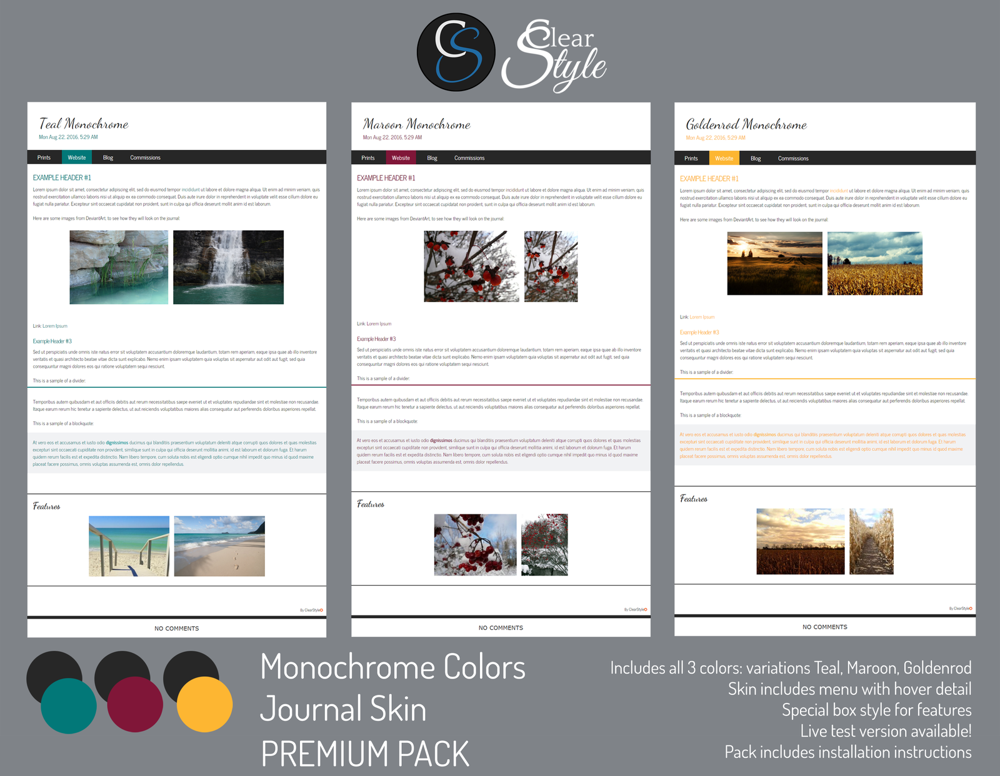
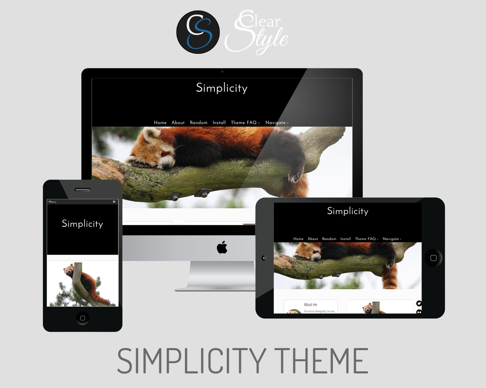

I have two Bachelors on Chemistry and Bromatogoly. Because of this, I had no knowledge or background on any programming language. Regardless of this, I had always been interested in learning and, I hoped, to develop games in the future.

One day, I thought that learning HTML5, CSS and Javascript would help me in the future to create web-based games. As I had no formal training, I started this journey on my own, and taught to myself to develop using different online resources.

 

## First Steps

My first training on programming came through a free course given on Platzi, focused on game development using Javascript. From there, I followed different online tutorials, and completed the practice and exercises offered at CodeAcademy.

However, I knew I required to "real-world" practice. As such, I started designing and creating skins for DeviantArt journals. [You can see my page here, even though the skins have not been updated in some time](https://www.deviantart.com/clearstyle). I designed skins related to a given topic, to a season, or more generic sleek styles. Sometimes, I used some free graphical resources offered by other members of the DeviantArt community but, most of the time, I created the graphics and artwork by myself.

A small personal achievement was obtaining a Daily Deviation [on one of my first journal skins](https://www.deviantart.com/clearstyle/art/Colors-White-Journal-Skin-Premium-537094383).

Nonetheless, when I was practicing with DeviantArt the platform did not allow to perform many changes in the HTML. Therefore, I was required to be creative on my use of CSS to achieve different results. With time, I decided to expand my horizons to other platforms.

 

## Other Platforms

The true and most relevant learning stage of this "adventure" started when I decided to dwell in making themes for Tumblr. I started using [Tumblr's default guide](https://www.tumblr.com/docs/en/custom_themes), and applying what I've learned so far. Soon I realized the themes were far bigger than DeviantArt skins, and that I required to trace the changes I did. I went back to the study board, and completed and approved a course on Git & GitHub management from Platzi.

It was in my Tumblr days when I started to test, search, and code everything I thought was interesting or caught my attention. I based the designs on those DeviantArt skins I felt were my favourites. The learning curve was steep as my training was not the best: I continued to learn and improve with each line of code I wrote.

A constant "fight" for me was creating responsive designs that would look good on most browsers and devices. And so, each skin took a considerable time to be finished, as I wanted them as polished as I could get them. All my themes are [still available on Etsy](https://www.etsy.com/shop/ClearStyleThemes)

This time has proven to be invaluable to me. It is not only of what I learned in terms of coding, but the practice I obtained on keep wrangling against bugs, researching on the internet, and self-teaching me that changed my way of thinking.

 

## ClearStyle

I don't maintain the themes and skins that I developed anymore. However, they are still available for use. Some of the DeviantArt skins are free for personal use, and others -as well as Tumblr themes- need to be purchased.

The following are my pages. I chose the brand name _Clear Style_, as I wanted a name that would reflect my style: simple, concise, sleek, with the reader's attention focused on the content and not distracted with the design, but at the same time attractive and modern.

- [ClearStyle DeviantArt](https://www.deviantart.com/clearstyle)
- [ClearStyle Etsy](https://www.etsy.com/shop/ClearStyleThemes)

 

## Courses & Resources
Here are some of the courses and resources I mentioned, and that I followed. I use more of them, but I didn't log the links to everything before. Now that I have a blog I will do it in the future.:

- Platzi: [Programación Básica](https://platzi.com/clases/programacion-basica/) and [HTML5+CSS](https://platzi.com/clases/html5-css3/)
- W3Schools [HTML Tutorial](https://www.w3schools.com/html/)
- CodeAcademy [HTML](https://www.codecademy.com/learn/learn-html) and [CSS](https://www.codecademy.com/learn/learn-css)
- Tumblr: [Creating custom themes](https://www.tumblr.com/docs/en/custom_themes)
- Platzi: [Git & GitHub](https://platzi.com/cursos/git-github/)

