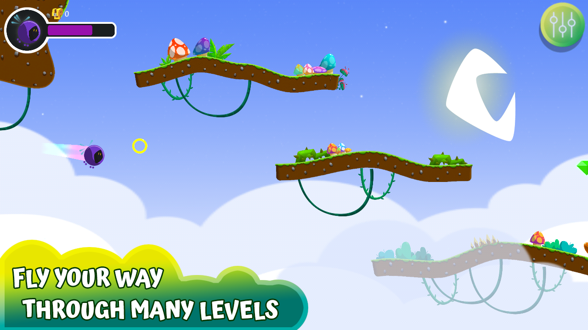
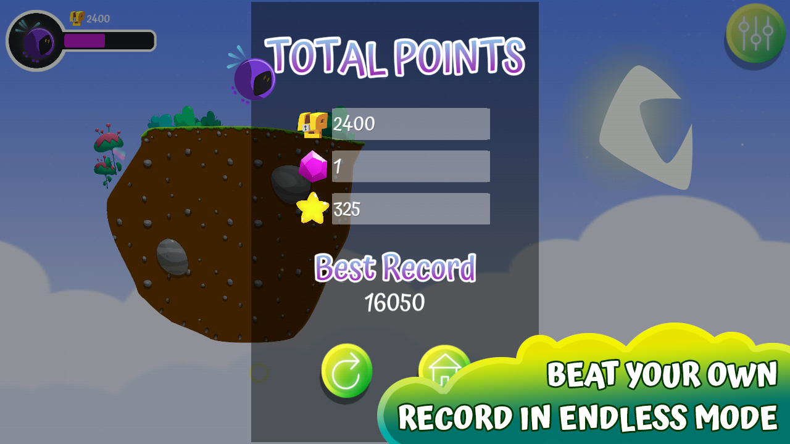

Some months ago, I embarked on the journey of creating my own indie video game studio, _Prowess Games_, and started the development of the first game to be published on Google Play.

 

## About the Game
_Quirky Flight_ is a procedural, horizontal scrolling game focused on avoiding obstacles. In order to progress in the game, you need to collect as many items as possible -including power ups. But beware! Power ups have pros and cons. For instance, Quirky, the main character, can become smaller and avoid enemies more easily, but the reduced size makes “grabbing” the power ups so much difficult.

Quirky will never fly in the same exact level, because if you lose, the level is randomly generated again so that the game doesn’t become repetitive. You will always have to react to the unexpected. But that is “Normal Mode”. _Quirky Flight_ also has an “Endless Mode” where you need to survive for as long as possible, and collect as many rings (points!) as you can.

 

You can find _Quirky Flight_ on Google Play:

 

## My Thoughts

The goal was that the game will be easy to play and catchy enough to help you pass the time. I wanted a fluid and friendly user experience. Because of this, ads are minimally invasive, and you will always have the choice on when to watch them; watching ads will always give you a reward!

Also, I finished Quirky Flight in a reasonable timeframe. I am quite happy with the final aesthetic of the game, and about how much I learned with it.

I am very proud of starting my studio _Prowess Games_ and kickstarting it with _Quirky Flight_. However, I’m eagerly facing forward to my next game -something more complex and ambitious. Can’t wait to write more about it!

Find **Prowess Games** at:

- Twitter: [\@ProwessGames](https://twitter.com/ProwessGames)
- KoFi: [https://ko-fi.com/prowessgames](https://ko-fi.com/prowessgames)
- Website: [https://www.prowessgames.net/](https://www.prowessgames.net/)
- Google Play: [Prowess Games](https://play.google.com/store/apps/developer?id=Prowess+Games)

  

_Google Play and the Google Play logo are trademarks of Google LLC._

