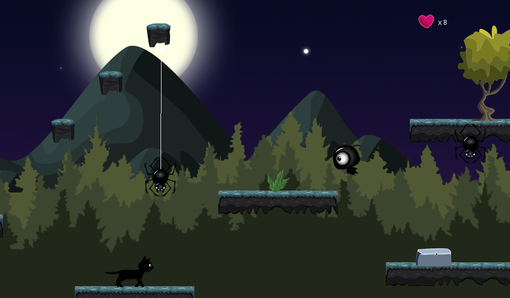

+++
# Project title.
title = "Catpernicus [Alpha]"

# Date this page was created.
date = 2019-11-25T00:00:00

# Project summary to display on homepage.
summary = "A platformer game with touches of stealth mode, made in Godot Engine, as the final project for one of my courses. Play as a cat with a mission, and don't spend your nine lives for it, or it is game over!"

# Tags: can be used for filtering projects.
tags = ["GDDs"]

# Optional external URL for project (replaces project detail page).
external_link = ""

# Slides (optional).
#   Associate this project with Markdown slides.
#   Simply enter your slide deck's filename without extension.
#   E.g. `slides = "example-slides"` references 
#   `content/slides/example-slides.md`.
#   Otherwise, set `slides = ""`.
slides = ""

# Links (optional).
url_pdf = ""
url_slides = ""
url_video = ""
url_code = ""

# Featured image
# To use, add an image named `featured.jpg/png` to your project's folder. 
[image]
  # Caption (optional)
  caption = ""
  
  # Focal point (optional)
  # Options: Smart, Center, TopLeft, Top, TopRight, Left, Right, BottomLeft, Bottom, BottomRight
  focal_point = ""
  
  preview_only = true
  
  
# Custom links (optional).
#   Uncomment line below to enable. For multiple links, use the form #`[{...}, {...}, {...}]`
[[url_custom]] 
  name = "Download [Win]" 
  url = "catpernicus.zip"
+++

This prototype game was developed as a final assignment for one the courses I undertook, namely “Developing Videogames III”. 

Catpernicus is a platformer game, with a little story: you play as a cat that needs to arrive to a secured place to deliver something. It has some touches of a stealth game, as you need to avoid enemies no matter what, as the cat (Catpernicus!) cannot attack or kill the monsters. But this isn’t strictly a stealth game, because only two types of enemies can “see” and attach the player, and one of them just “hears” it (sprinting is noisy, btw).

 

## The Idea

The aim of this game is to try to get back to those old platformers in which you learn by repetition. But I decided to add those touches of stealth games to have a little distinction. Also, as you play as a cat, you have only nine (9!) lives to spend, and you can’t recover them: loosing all 9 lives means a perma-death, and you start over from the beginning.

This game was developed entirely with Godot 3.1, and was my first big experience with that engine. I found it to be a great tool, with some strengths and weaknesses of course, but full of possibilities.

Here is a trailer featuring a short in-game footage:

<iframe width="1024" height="600" src="https://www.youtube.com/embed/1E0QJD7Pyec" frameborder="0" allow="accelerometer; autoplay; encrypted-media; gyroscope; picture-in-picture" allowfullscreen></iframe>

 

## Download

The game is available for download. _However, this game is in alpha state:_ it has some bugs that are not addressed yet. 

- **Windows:** [Download](catpernicus.zip). Simply extract and run.

 

## Development & Resources
I developed this game in Godot Engine. The trailer was recorded using [OBS Studio](https://obsproject.com/) and edited in Photoshop CS6 and Sony Movie Studio.

The following resources were used, as they appear in the game's credits:

* Sounds: [Fall](https://freesound.org/people/fabianacarmonas/sounds/491558/), [soft steps](https://freesound.org/people/pgi/sounds/211457/), [death](https://freesound.org/people/Natty23/sounds/257274/), [zombie](https://freesound.org/people/Under7dude/sounds/163439/), [eye ghost attack](https://freesound.org/people/juskiddink/sounds/138147/), [crawling](https://freesound.org/people/DRFX/sounds/347371/), [vampire](https://freesound.org/people/pillonoise/sounds/320721/), [picking up items](https://freesound.org/people/Leszek_Szary/sounds/146723/), [check point](https://freesound.org/people/Leszek_Szary/sounds/191591/), [music](https://incompetech.filmmusic.io/song/3837-gymnopedie-no-1/).
* Sprites: [skull, ring and diamond](https://www.gamedevmarket.net/asset/game-tile-pack-bundle-10-8938/), [heart and land](https://graphicriver.net/item/2d-platform-game/23085863), [enemies](https://graphicriver.net/item/villain-game-character-sprite-sheets/8204344), [cat](https://graphicriver.net/item/black-cat-game-sprite/11784968)

