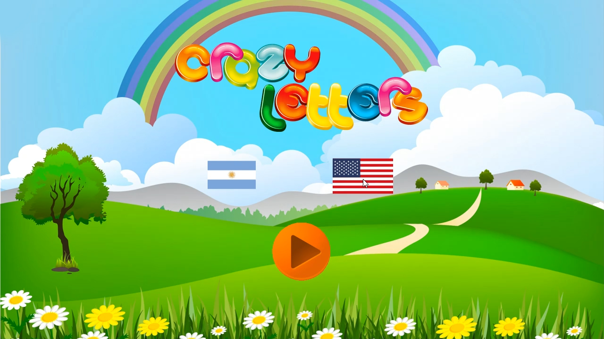

+++
# Project title.
title = "Game: Crazy Letters [Alpha]"

# Date this page was created.
date = 2018-01-16T00:00:00

# Project summary to display on homepage.
summary = "A game intended for very young children (2-3 years). The goal is to prevent the letters from falling from the screen; the difficulty increases with time. The game aims to help children associate the letter or number symbol with the sound, in different languages. For now, it only has English and Spanish implemented."

# Tags: can be used for filtering projects.
tags = ["Alpha Games"]

# Optional external URL for project (replaces project detail page).
external_link = ""

# Slides (optional).
#   Associate this project with Markdown slides.
#   Simply enter your slide deck's filename without extension.
#   E.g. `slides = "example-slides"` references 
#   `content/slides/example-slides.md`.
#   Otherwise, set `slides = ""`.
slides = ""

# Links (optional).
url_pdf = ""
url_slides = ""
url_video = "/project/game-crazyletters/crazyletters.mp4"
url_code = ""

# Featured image
# To use, add an image named `featured.jpg/png` to your project's folder. 
[image]
  # Caption (optional)
  caption = ""
  
  # Focal point (optional)
  # Options: Smart, Center, TopLeft, Top, TopRight, Left, Right, BottomLeft, Bottom, BottomRight
  focal_point = ""
  
  preview_only = true
  
  
# Custom links (optional).
#   Uncomment line below to enable. For multiple links, use the form #`[{...}, {...}, {...}]`
[[url_custom]] 
  name = "Download [Win]" 
  url = "h/project/game-crazyletters/CrazyLetters.zip"
+++
 

A game intended for very young children (2-3 years). The goal is to prevent the letters from falling from the screen; the difficulty increases with time. The game aims to help children associate the letter or number symbol with the sound, in different languages. For now, it only has English and Spanish implemented.

This game is on alpha stage.

 

## The Idea
I developed this game for the final assignment for the course "Programming Algorithms and Models (I)" for the Bachelor on Game Design & Development, at UNL FICH, Santa Fe, Argentina. The assignment required to create any game that would feature certain types of movement: straight line uniform movement, uniformly varied rectilinear motion, free fall, and vertical and oblique shots.

However, I did not want to create the classic shooter game, with tanks shooting bullets as parables. I have several very-young nieces and nephews whose birthdays were upcoming near the assignment deadline, and that inspired me to create something different: a game for children.

However, the audience target is children learning the alphabet. This became a challenge, as any written instruction would not be read (maybe except for a parent/adult), and rewards or warnings had to be more straightforward enough for a child to understand.

Designing this was an exciting opportunity, as I had to think out of the box and for an audience, I do not often think about it.

Here is a trailer featuring a short in-game footage:

<iframe width="1280" height="720" src="https://www.youtube.com/embed/bKNYqSBgLu0" frameborder="0" allow="accelerometer; autoplay; encrypted-media; gyroscope; picture-in-picture" allowfullscreen></iframe>

 

## Download

The game is available for download. _However, this game is in alpha state:_ it has some bugs that are not addressed yet. To run the game you will require to have [Visual C++ Redistributable](https://support.microsoft.com/en-us/help/2977003/the-latest-supported-visual-c-downloads) installed on your computer.

- **Windows:** [Download](/project/game-crazyletters/CrazyLetters.zip). Simply extract and run. If any error regarding DLLs pops up, you are missing the correct Visual C++ version.

 

## Development & Resources
I developed this game in Visual Studio in C++, and with SFML. The trailer was recorded using [OBS Studio](https://obsproject.com/) and edited in Photoshop CS3 and Sony Movie Studio.

The following resources were used. Some of them were created by me, such as the letters sounds in English and Spanish.

- Music: [Jambalaya Loop](https://www.dl-sounds.com/royalty-free/jambalaya-loop/)
- Voice: Self-Recorded (my partner)
- Background: [UIHere](https://www.uihere.com/free-graphics/rainbow-landscape-eps-ai-file-448082)
- Letters: [pngtree](https://pngtree.com/freepng/cute-pictures-letter_1024804.html)
- Flags: [Mr Hopnguyen, at IconFinder](https://www.iconfinder.com/iconsets/ensign-11)
- Play Button: [Google Icons, at IconFinder](https://www.iconfinder.com/icons/86367/o_play_icon)

