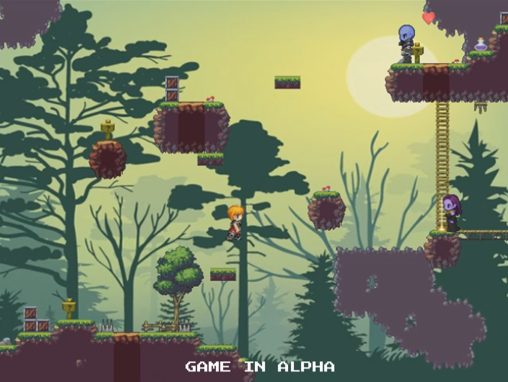

+++
# Project title.
title = "Game: Platformer Land [Alpha]"

# Date this page was created.
date = 2018-10-27T00:00:00

# Project summary to display on homepage.
summary = "A platformer game intended for the casual player that enjoys jumping, dodging and fighting enemies while overcoming increasingly dangerous obstacles, in a retro pixel setting. Playable in a browser with basic keyboard controls."

# Tags: can be used for filtering projects.
tags = ["Alpha Games"]

# Optional external URL for project (replaces project detail page).
external_link = ""

# Slides (optional).
#   Associate this project with Markdown slides.
#   Simply enter your slide deck's filename without extension.
#   E.g. `slides = "example-slides"` references 
#   `content/slides/example-slides.md`.
#   Otherwise, set `slides = ""`.
slides = ""

# Links (optional).
url_pdf = ""
url_slides = ""
url_video = "/project/game-platformerland/platformerland.mp4"
url_code = ""

# Featured image
# To use, add an image named `featured.jpg/png` to your project's folder. 
[image]
  # Caption (optional)
  caption = ""
  
  # Focal point (optional)
  # Options: Smart, Center, TopLeft, Top, TopRight, Left, Right, BottomLeft, Bottom, BottomRight
  focal_point = ""
  
  preview_only = true
  
  
# Custom links (optional).
#   Uncomment line below to enable. For multiple links, use the form #`[{...}, {...}, {...}]`
[[url_custom]] 
  name = "Play" 
  url = "https://fergamboa.itch.io/platformer-land"
+++
 

A platformer game intended for the casual player that enjoys jumping, dodging and fighting enemies while overcoming increasingly dangerous obstacles, in a retro pixel setting. Playable in a browser with basic keyboard controls.

This game is on alpha stage.

 

## The Idea
I developed this game for the final assignment for the course "Videogame Development (II)" for the Bachelor on Game Design & Development, at UNL FICH, Santa Fe, Argentina. The assignment required to developa game using HaxeFlixel, which had to:

- Be a platformer game with a main character.
- Use a tilemap (scenario).
- Have shooting, enemies and health items.
- Have entry and exit points on each level.
- And incorporate any new mechanich or challenge on each level.

Besides that, we could improvise and create anything to our liking. Based on that, I wanted to bring the retro-pixel style of old games where the challenge of overcoming increasing difficulties was the main drive of the game.

My final result was a simple, buy entertaining game, where each level requires strategic thinking in order to overcome the obstacles without mindlessly, repeatedly dying. I used simple and classic keyboard controls, so that any player can play intuitively, without struggling to decipher _how_ to play the game. 

Here is a trailer featuring a short in-game footage:

<video width="1280" height="720" controls>
  <source src="/project/game-platformerland/platformerland.mp4" type="video/mp4">
</video>

 

## Download

The game can be played in any web browser, but I recommend using Mozilla Firefox for it. <a href="https://fergamboa.itch.io/platformer-land" target="_blank">You can play it on my Itch.IO page</a>.

 

## Engines & Tools
I developed this game using Tiled to create the maps, and HaxeFlixel for the logic and main development. The trailer was recorded using [OBS Studio](https://obsproject.com/) and edited in Photoshop CS3 and Sony Movie Studio.

