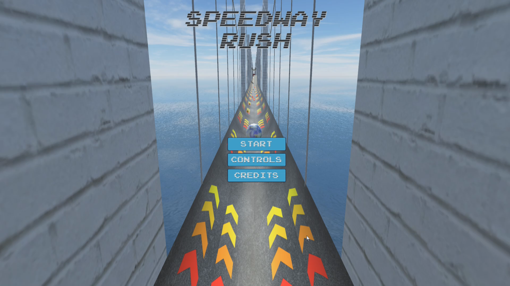
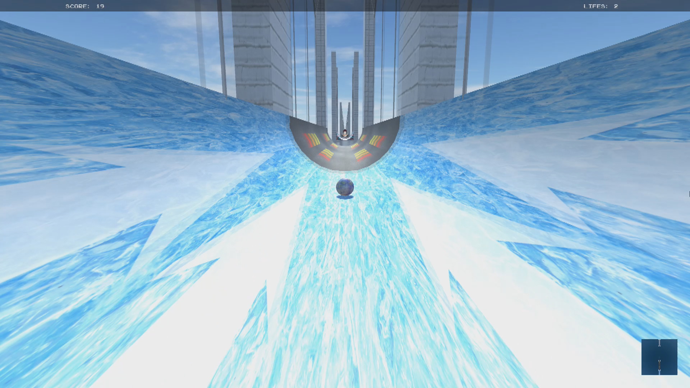

+++
# Project title.
title = "Game: Speedway Rush [Alpha]"

# Date this page was created.
date = 2019-02-28T00:00:00

# Project summary to display on homepage.
summary = "A frenetic, dynamic arcade-style game, where the player cannot fully control de marble... at least, directly. Thought to keep you at the edge of your seat, test your reflexes and challenge your ability to react to different obstacles. Made in Unity3D as a final assignment of a course in my BsC."

# Tags: can be used for filtering projects.
tags = ["Alpha Games"]

# Optional external URL for project (replaces project detail page).
external_link = ""

# Slides (optional).
#   Associate this project with Markdown slides.
#   Simply enter your slide deck's filename without extension.
#   E.g. `slides = "example-slides"` references 
#   `content/slides/example-slides.md`.
#   Otherwise, set `slides = ""`.
slides = ""

# Links (optional).
url_pdf = ""
url_slides = ""
url_video = "/project/game-speedwayrush/SpeedwayRush.mp4"
url_code = ""

# Featured image
# To use, add an image named `featured.jpg/png` to your project's folder. 
[image]
  # Caption (optional)
  caption = ""
  
  # Focal point (optional)
  # Options: Smart, Center, TopLeft, Top, TopRight, Left, Right, BottomLeft, Bottom, BottomRight
  focal_point = ""
  
  preview_only = true
  
  
# Custom links (optional).
#   Uncomment line below to enable. For multiple links, use the form #`[{...}, {...}, {...}]`
[[url_custom]] 
  name = "Download" 
  url = ""
+++
 

A frenetic, dynamic arcade-style game, where the player cannot fully control de marble... at least, directly. Thought to keep you at the edge of your seat, test your reflexes and challenge your ability to react to different obstacles. 

This game is on alpha stage.

 

## The Idea

I developed this alpha game as the final assignment for a course titled "Manipulating 3D Objects" in my Game Design and Development BSc. We had a great deal of freedom to let our creativity guide us, as the only limitations were to use Unity3D to create a full, single level with starting and ending screens.

And so, I started to draft ideas. The deadline was quite short, so I did not had enough time to expand myself on very intricate or extensive games. As a result, I had to tailor my design to fit in with the time constraints -I barely had roughly ten days, and a steep learning curve ahead of me.

I was sure I wanted to create an arcade game -something fun and dynamic. So after discarding many drafts, I decided to create a game when the player could not fully control de main "character" -in this case, a marble whose speed is not affected by the player's actions. The aim was to give a feeling of frenzy and rushing adrenaline, where you can only dodge, jump or perform limited actions to overcome the obstacles.

The result was _Speedway Rush_: an arcade-style game which still manages to get some realism in its aesthetics. It is a simple, casual game where the challenges and the desire to surpass the threats make it adictive. It can be played over and over, either to explore new roads, or to try to beat your own score... which leads to very uncontrollable, unexpected situations.

<iframe width="1280" height="720" src="https://www.youtube.com/embed/D09teIckJfg" frameborder="0" allow="accelerometer; autoplay; encrypted-media; gyroscope; picture-in-picture" allowfullscreen></iframe>

 

## Download

The game is [available for download for Windows only](https://drive.google.com/open?id=15YZPDAvINcYwhV5ShdKxw_J9H3SjvJmq). You do not need any other asset to play it. Just uncompress, and lunch from the folder. Please, take in mind this is an _alpha game_.

 

## Engines & Tools

I developed this game using Unity3D, and free textures obtained through different royalty-free websites. The trailer was recorded using [OBS Studio](https://obsproject.com/) and edited in Photoshop CS3 and Sony Movie Studio.

