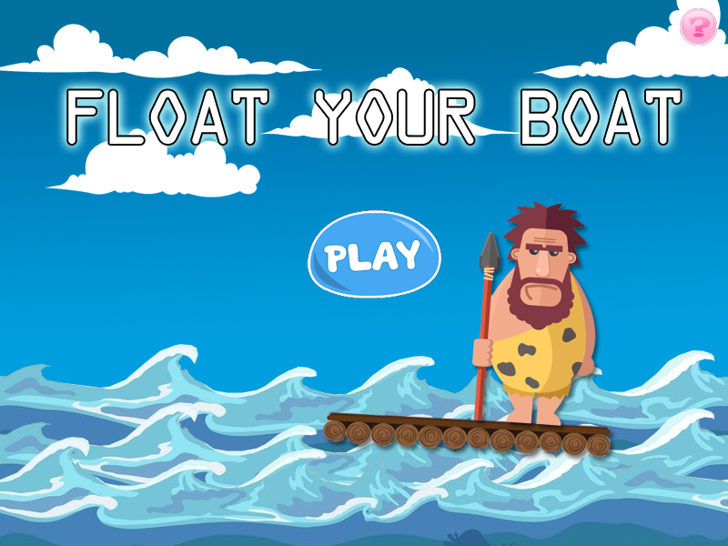

+++
# Project title.
title = "Design: Float Your Boat"

# Date this page was created.
date = 2018-12-18T00:00:00

# Project summary to display on homepage.
summary = "Casual smartphone/tablet fun arcade game, where you need to rescue as many cave-people as possible to overcome the flood. Use your device's gyroscope to control a raft, fight against current sweeps, wild animals and unforeseen events while you make your escape."

# Tags: can be used for filtering projects.
tags = ["GDDs"]

# Optional external URL for project (replaces project detail page).
external_link = ""

# Slides (optional).
#   Associate this project with Markdown slides.
#   Simply enter your slide deck's filename without extension.
#   E.g. `slides = "example-slides"` references 
#   `content/slides/example-slides.md`.
#   Otherwise, set `slides = ""`.
slides = "example-slides"

# Links (optional).
url_pdf = ""
url_slides = ""
url_video = ""
url_code = ""

# Custom links (optional).
#   Uncomment line below to enable. For multiple links, use the form `[{...}, {...}, {...}]`.
# url_custom = []

# Featured image
# To use, add an image named `featured.jpg/png` to your project's folder. 
[image]
  # Caption (optional)
  caption = ""
  
  # Focal point (optional)
  # Options: Smart, Center, TopLeft, Top, TopRight, Left, Right, BottomLeft, Bottom, BottomRight
  focal_point = ""
  
  preview_only = true
+++
 

Casual smartphone/tablet fun arcade game, where you need to rescue as many cave-people as possible to overcome the flood. Use your device's gyroscope to control a raft, fight against current sweeps, wild animals and unforeseen events while you make your escape.

This game has a complete GDD. If you are interested, contact me to discuss it.

 

## Audience
The game is targeted to teenagers and young adults, wanting a casual, passtime game. It is a solo-game, where the players always face AI elements and challenges.

 

## Characteristics
The game is controled by the device's giroscope, which turns the wooden raft in different directions. It also has two touch controls, aimed to be used with the thumbs: rowing or counter-rowing the boat.

Different cave-people bring different qualities to your boat, and increase your score if you bring them to the safe shore successfully. Even more, each type of raft has different characteristics and is able to carry a given number of people.

The game features an in-game shop that sells visual changes only, such as seasons and outfits or rafts designs.

 

## Visual Style
The visuals are vector graphics, suitable to be used on low-performance devices. All the designs on the GDD are made by me, using different free resources. The above example map was made using TileMap.Some of the resources are:

- Cave Man: [Vecteezy](https://www.vecteezy.com/vector-art/127402-free-ice-age-vector)
- Clouds: [Freepik](https://www.freepik.com/free-vector/collection-of-fluffy-white-clouds_982328.htm)
- Terrain: [OpenGameArt](https://opengameart.org/content/tiled-terrains)
- Sprites: [Sprite Generator](http://gaurav.munjal.us/Universal-LPC-Spritesheet-Character-Generator/)
- Font: [OCR A Extended](https://fontzone.net/font-details/ocr-a-extended)

