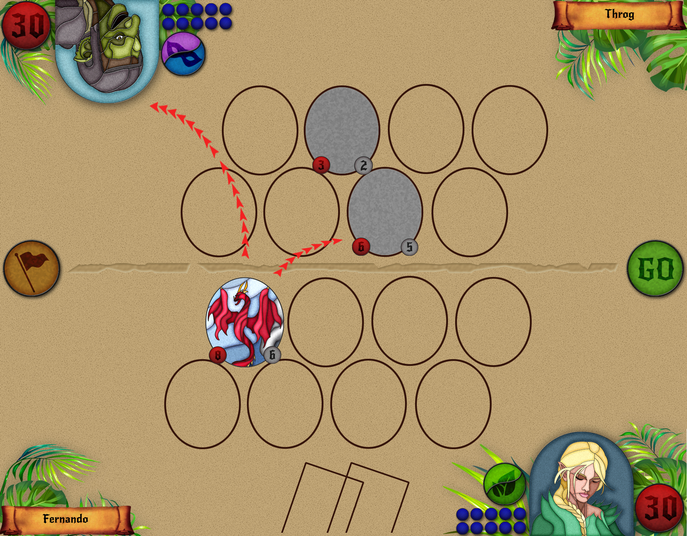

+++
# Project title.
title = "Design: Warring Ages"

# Date this page was created.
date = 2017-11-16T00:00:00

# Project summary to display on homepage.
summary = "Online card game for PC and Smartphone. You pick a deck before each battle from three options previously stored, alongside with a helper card. The game alternate between two stances: peace and war, where cards have a different behaviour on each of them."

# Tags: can be used for filtering projects.
tags = ["GDDs"]

# Optional external URL for project (replaces project detail page).
external_link = ""

# Slides (optional).
#   Associate this project with Markdown slides.
#   Simply enter your slide deck's filename without extension.
#   E.g. `slides = "example-slides"` references 
#   `content/slides/example-slides.md`.
#   Otherwise, set `slides = ""`.
slides = "example-slides"

# Links (optional).
url_pdf = ""
url_slides = ""
url_video = ""
url_code = ""

# Custom links (optional).
#   Uncomment line below to enable. For multiple links, use the form `[{...}, {...}, {...}]`.
# url_custom = []

# Featured image
# To use, add an image named `featured.jpg/png` to your project's folder. 
[image]
  # Caption (optional)
  caption = ""
  
  # Focal point (optional)
  # Options: Smart, Center, TopLeft, Top, TopRight, Left, Right, BottomLeft, Bottom, BottomRight
  focal_point = ""
  
  preview_only = true
+++
 

Online card game for PC and Smartphone. You pick a deck before each battle from three options previously stored, alongside with a helper card. The game alternate between two stances: peace and war, where cards have a different behaviour on each of them.

This game has a complete GDD. If you are interested, contact me to discuss it.

 

## Audience
The game is mostly targeted to teanagers and young adults, and can be play casually against an AI, against players with no scoring involved. It also includes the possibility of ranked plays and e-sports.

 

## Novelties
This design has several distinguishable characteristics:

- **Peace and War Stances** allow each card to have different powers or behavior on each stance. As such, the player needs to adapt their strategy to the curent _warring age_ of the game.
- **Relevant Card Positions** implies that the position and alignment of the cards has a direct effect on how attacks or defenses can be made. As a result, it requires a more thoughtful approach.

 

## Visual Style
As the game story/world is set on medieval times, the visuals are planned to be similar to stained glass designs. Current examples where made by myself using Photoshop CS3.

