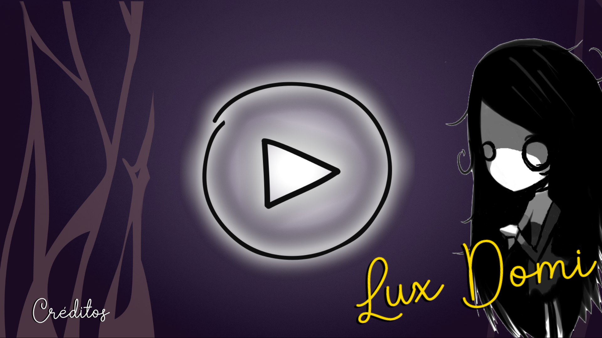
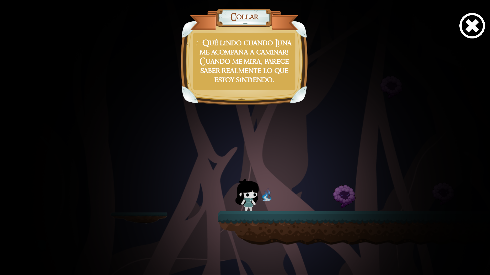
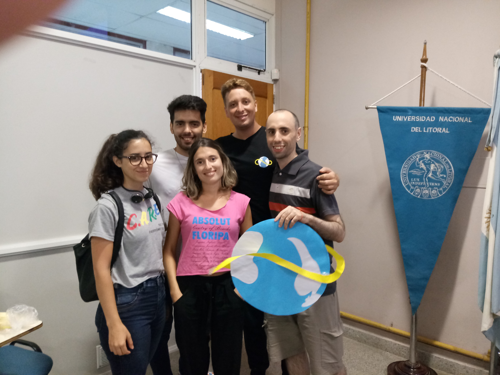

+++
# Project title.
title = "Game: Lux Domi [GGJ]"

# Date this page was created.
date = 2019-01-27T00:00:00

# Project summary to display on homepage.
summary = "Even in the darkest moments, some sensations transport us to a quiet place that makes us feel calm, secure: our home. A game made in Construct2 for the #GlobalGameJam event at UNL FICH (Santa Fe, Argentina), under the theme _'What does home mean to you?_'."

# Tags: can be used for filtering projects.
tags = ["GameJam"]

# Optional external URL for project (replaces project detail page).
external_link = ""

# Slides (optional).
#   Associate this project with Markdown slides.
#   Simply enter your slide deck's filename without extension.
#   E.g. `slides = "example-slides"` references 
#   `content/slides/example-slides.md`.
#   Otherwise, set `slides = ""`.
slides = ""

# Links (optional).
url_pdf = ""
url_slides = ""
url_video = ""
url_code = "https://github.com/fer-gamboa/luxdomi-ggj19"

# Featured image
# To use, add an image named `featured.jpg/png` to your project's folder. 
[image]
  # Caption (optional)
  caption = ""
  
  # Focal point (optional)
  # Options: Smart, Center, TopLeft, Top, TopRight, Left, Right, BottomLeft, Bottom, BottomRight
  focal_point = ""
  
  preview_only = true
  
  
# Custom links (optional).
#   Uncomment line below to enable. For multiple links, use the form #`[{...}, {...}, {...}]`
[[url_custom]] 
  name = "GGJ Site" 
  url = "https://globalgamejam.org/2019/games/lux-domi"
  
[[url_custom]] 
  name = "Play Game" 
  url = "https://kitiel.itch.io/lux-domi"
+++
 

Even in the darkest moments, some sensations transport us to a quiet place that makes us feel calm, secure: our home. A game made in Construct2 for the #GlobalGameJam event at UNL FICH (Santa Fe, Argentina), under the theme _'What does home mean to you?_'.

You can read a [blog post about my experience at Global Game Jam 2019 here](/post/ggj2019).

 

## The Idea

I have a friend that would often say to me _"I want to go home"_, even when they were _at_ their house. At first, I did not understand what they meant with that... and neither did they. But one day, they told me they'd found an explanation: it meant to go back to a secure, safe situation or location where they were comfortable and contained. So, when the theme was revealed I instantly thought of my friend, and what "going home" meant to them.

The name Lux Domi comes from the Latin words _lux_ (meaning light) and _domi_ (meaning home/house). This game is very related to the anecdote above, as the game's goal is to find the protagonist's home by exploring her emotions: fears, feelings and physical objects that remind her of her home -that secure, safe place.

Each object found will bring a memory and, with it, a clue on what home means to the protagonist. Likewise, the monsters or enemies found throughout the game represent her insecurities, fears and the opposite of home. This is because the location is not a random world, but the protagonist's own mind.

A tiny light always accompanies her, seen as a blue fire lit beside her. You can read this in several ways, as it is open for interpretation, but it is something like the hope of finding your home, or how much she can endure before fears get to her. The flame consumes as time passes by, and it is renewed each time she finds an object that brings her closer to _home_.

As the light reduces in size, the field of vision becomes smaller. As a result, some players may tend to be more static, as they cannot see with certainty where they are going or if there is an enemy approaching. But when the light goes out, the game starts over. However, if you try and fail, you will start on the nearest checkpoint. A way of thinking this is that it is more valuable to try and fail, and learn from that than be paralysed by fear that you don't know from where they will strike.

 

## Download

Following the rules of GGJ, the game is available for download and the source code is also available:

- Source Code: [GitHub Page](https://github.com/fer-gamboa/luxdomi-ggj19)
- Play Online: [Lux Domi](https://kitiel.itch.io/lux-domi). Be careful, if playing in fullscreen, it may not work in some versions of Chrome. It works perfectly in Mozilla.
- Download: [Windows x64](/LuxDomi-Win64.zip) or [Windows x86](/LuxDomi-Win32.zip).

 

## Development & Team
The game was developed at the Global Game Jam 2019, at Universidad Nacional del Litoral, Facultad de Ingeniería y Ciencias Hídricas in Santa Fe, Argentina. We used Construct2 and different free resources to build the game.

The team was composed of Juan Ignacio Ferrer, Luciana Yoris, Marilina Galliano, Andrea Lozano, Andrés Macagno, Jesús Melenque, Water Sotil and myself, Fernando Gamboa.

